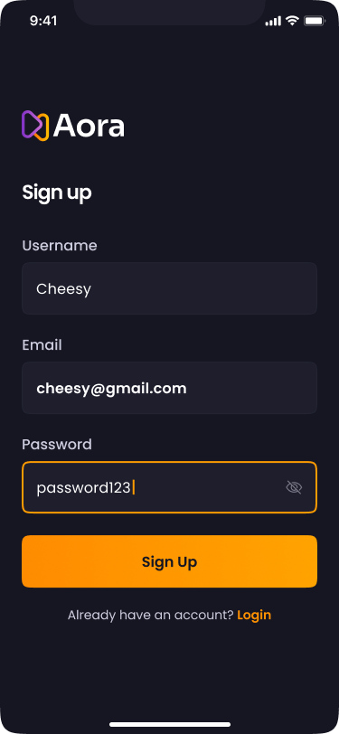
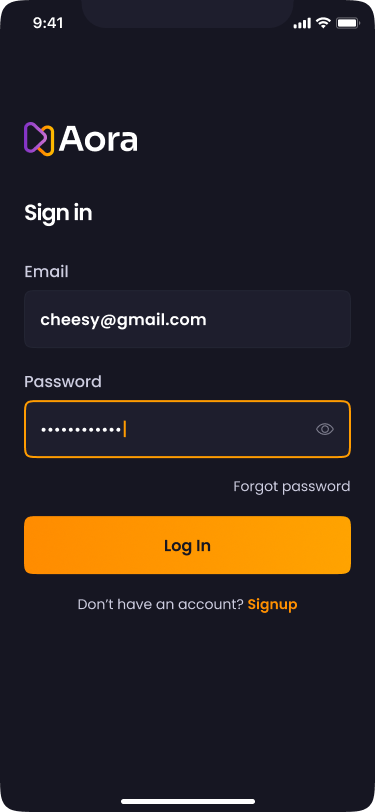
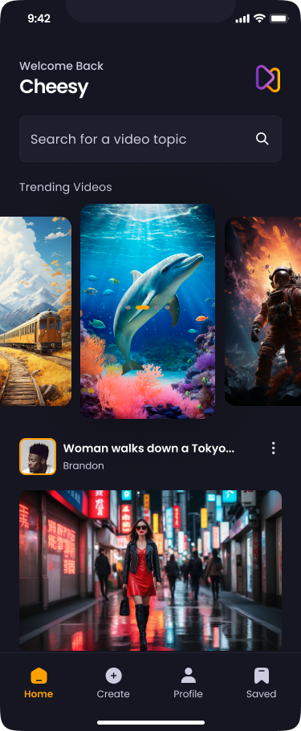
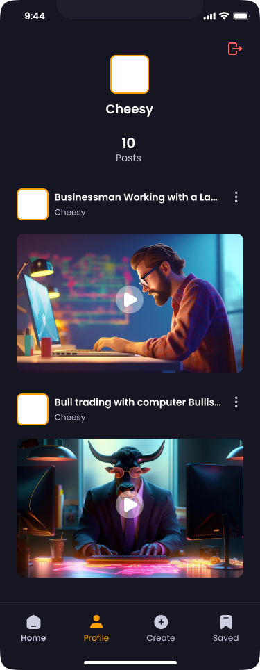

<a name="readme-top"></a>

<br />
<div align="center">
  <a href="https://github.com/AMGHAR-ELMAHDI/React-Native-Aora">
    
  </a>

<h3 align="center">Aora</h3>

  <p align="center">
  Welcome to my React Native application! This app allows users to share videos and photos captured in real life or created using AI. Built with React Native, Tailwind CSS, and Expo, it provides a seamless user experience across devices.
    <br />  
    <br />

  </p>
</div>

<details>
  <summary>Table of Contents</summary>
  <ol>
    <li>
      <a href="#about-the-project">About The Project</a>
      <ul>
        <li><a href="#built-with">Built With</a></li>
        <li><a href="#features">Features</a></li>
      </ul>
    </li>
    <li>
      <a href="#getting-started">Getting Started</a>
      <ul>
        <li><a href="#prerequisites">Prerequisites</a></li>
        <li><a href="#installation">Installation</a></li>
      </ul>
    </li>
    <li><a href="#usage">Usage</a></li>
  </ol>
</details>

## About The Project

<p>This application was developed using Expo, which enabled rapid development and streamlined the build process for both iOS and Android platforms. The user interface is styled with Tailwind CSS, allowing for a responsive and visually appealing design that enhances the overall user experience.

For backend services, I utilized Appwrite, a powerful open-source backend platform. Appwrite efficiently handles user data storage, authentication, and real-time database functionalities, ensuring that user information is secure and easily accessible.</p>

<div style="display: flex; flex-wrap: wrap; gap: 10px;">
    
    
    
    
    
    
    
</div>

## Features

- Login & Register Pages: Securely log in to your account or create a new one with our user-friendly registration process. This ensures that your shared content is personalized and private.
- Create Posts: Easily upload videos and photos to share your creative moments with the community. The intuitive interface makes posting a breeze!
- Home Page: Discover new and trending content shared by users from around the world.
- User Profiles: Visit individual user profiles to view their published media and follow their creative journey.
- Search Functionality: Effortlessly search for specific posts or users to find exactly what you're looking for.
- Saved Posts Page: Keep track of the posts you love by saving them to your personal collection. This feature allows you to revisit your favorite content anytime.

### Built With

- <a href="https://reactnative.dev">React Native</a>
- <a href="https://tailwindcss.com">Nativewind "aka" Tailwindcss</a>
- <a href="https://appwrite.io">Appwrite</a>

## Getting Started

To get a local copy up and running follow these simple example steps.

### Prerequisites

- Node.js
  <h3><a href="https://nodejs.org/en/download/package-manager">Click Here to Install</a></h3>

### Installation

1. Clone the repo
   ```sh
   git clone git@github.com:AMGHAR-ELMAHDI/React-Native-Aora.git
   ```
2. Install NPM packages
   ```sh
   npm install
   ```

## Usage

```sh
 npm start
```


## Contact

<h3 >
AMGHAR ELMAHDI
<h3>

- [@LinkedIn](https://www.linkedin.com/in/elmahdi-amghar-148124177/)

- amgharmahdi1@gmail.com
